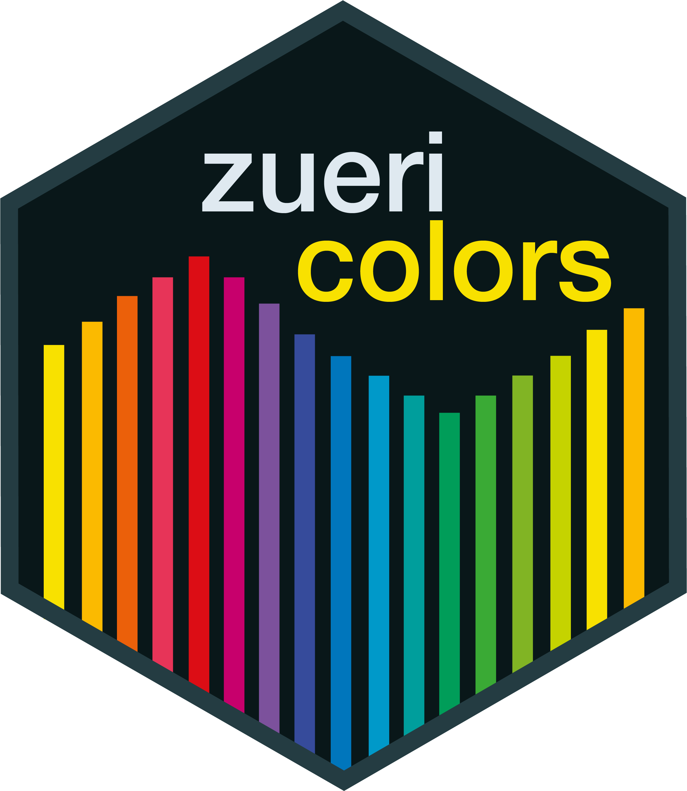
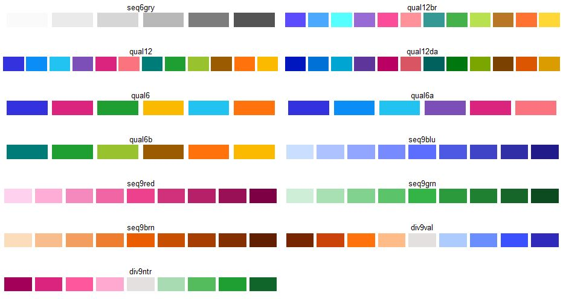

# zuericolors
zuericolors is an R-Package, which provides specific colors according to the corporate design of the city of Zurich. The package contains all colors that [Statistik Stadt Zürich](https://www.stadt-zuerich.ch/prd/de/index/statistik.html) needs for the creation of graphs. There are two main functions in zuericolors:

* `get_zuericolors` extracts colors of a specific color palette and puts them into a vector.
* `view_zuericolors` prints a specific color palette. Is useful for visual inspection.

## Installation
The easiest way to get zuericolors is to install it from this repo:

```{r, eval = FALSE}
# install.packages("devtools")
devtools::install_github("StatistikStadtZuerich/zuericolors")
```

Alternatively, download the files (by clicking 'Clone or download' / 'Download Zip'), extract it to any location on your computer, e.g. to your Desktop and then run:

```{r, eval = FALSE}
remotes::install_local("<path_to_location>/zuericolors-main", dependencies = FALSE)
```

## Version
To check your version of zuericolors, run:

```{r, eval = FALSE}
packageVersion("zuericolors")
```

## Available Palettes



## Usage

```{r, message = FALSE}
library(zuericolors)

# Get all the colors from palette "qual6"
get_zuericolors(palette = "qual6")

[1] "#3431DE" "#DB247D" "#1D942E" "#FBB900" "#23C3F1" "#FF720C"

# Get first color from palette "divntrgry"
get_zuericolors(palette = "divntrgry", nth = 1)

[1] "#EA4F61"

# Get first four colors from palette "contrasting12"
get_zuericolors("contrasting12", nth = 1:4)

[1] "#A30059" "#DB247D" "#FF579E" "#FFA8D0"

# View color palette "harmonic12"
view_zuericolors("seqblu")
```


## Getting help

If you encounter a bug, please contact statistik@zuerich.ch.
